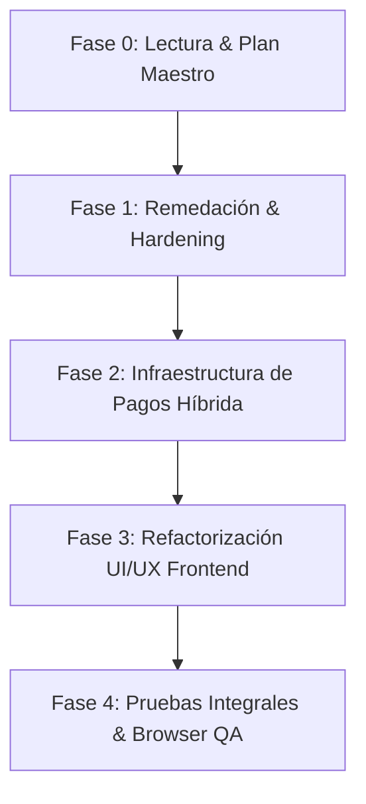

# Plan Maestro de Implementación — Proyecto Sonivo

**Fecha**: 27 de Septiembre, 2026  
**Rol**: Arquitecto Principal, Líder de QA y Orquestador General  
**Estado de Aprobación**: ⏳ PENDIENTE DE REVISIÓN Y APROBACIÓN POR EL USUARIO

---

## 📌 Contexto e Inventario de Directrices (Indexación de Skills y Stack)

De acuerdo a la indexación realizada sobre la infraestructura del proyecto:
- **Backend**: .NET 9.0 (`Sonivo.Api`, `Sonivo.Application`, `Sonivo.Domain`, `Sonivo.Infrastructure`) con EF Core, ASP.NET Core Identity y PostgreSQL (`compose.yaml`).
- **Frontend**: React 19 + Vite + TailwindCSS v4 (`sonivo-web`) con TypeScript 6, Lucide React, `qrcode.react`, SignalR client.
- **Skills y Reglas Autorizadas**: 14 Habilidades Locales (`code-review`, `codebase-design`, `diagnosing-bugs`, `domain-modeling`, `grill-with-docs`, `grilling`, `impeccable`, `implement`, `prototype`, `research`, `resolving-merge-conflicts`, `tdd`, `to-spec`, `to-tickets`) y la política vinculante de [`TOOLING-AUDIT.md`](file:///p:/repos/sonivo/docs/tooling/TOOLING-AUDIT.md).

---

## 🗺️ Hoja de Ruta Incremental por Fases



---

### 🛡️ Fase 1: Remedación de Vulnerabilidades y Hardening Backend
- **Objetivo**: Corregir vulnerabilidades identificadas en el frontend (`npm audit`) e implementar cabeceras HSTS/CSP y Rate Limiting en el API de .NET 9.
- **Sub-Tareas**:
  1. `T-SEC-01` (Worker DevSecOps): Ejecutar remediación de paquetes vulnerables `pdfjs-dist` y dependencias en `web/sonivo-web/package.json` vía `npm audit fix`.
  2. `T-SEC-02` (Worker Backend): Configurar Middleware de Cabeceras de Seguridad HSTS (`Strict-Transport-Security`), CSP (`Content-Security-Policy`), `X-Frame-Options: DENY`, `X-Content-Type-Options: nosniff`.
  3. `T-SEC-03` (Worker Backend): Configurar políticas de `Microsoft.AspNetCore.RateLimiting` en endpoints sensibles (`/api/auth/*`, `/api/webhooks/*`).

---

### 💳 Fase 2: Infraestructura de Pagos Híbrida (Stripe + Mercado Pago)
- **Objetivo**: Desacoplar el motor de cobros mediante el patrón Gateway/Adapter en `Sonivo.Application` e implementar controladores seguros con HMAC e Idempotencia en PostgreSQL.
- **Sub-Tareas**:
  1. `T-PAY-01` (Worker Backend): Crear entidades EF Core `Subscription`, `Plan`, `PaymentCustomer` y `WebhookEventLog` con sus respectivas migraciones PostgreSQL.
  2. `T-PAY-02` (Worker Backend): Definir la interfaz `IPaymentGateway` y las clases adaptadoras `StripePaymentGateway` y `MercadoPagoPaymentGateway`.
  3. `T-PAY-03` (Worker Backend): Implementar `WebhooksController` con verificación criptográfica HMAC SHA-256 (`Stripe-Signature` / `X-Signature`), validación temporal contra *Replay Attacks* (tolerancia de 300s) e Idempotencia en BD.

> **REVERTED per ADR-0042 (2026-09-28):** Fase 2 billing scaffold removed — no ADR ever authorized it; Q10 billing is Deferred.

---

### 🎨 Fase 3: Refactorización UI/UX Frontend (React 19 + Tailwind v4)
- **Objetivo**: Rediseñar la navegación con un Sidebar colapsable persistente, desacoplar el reproductor global de audio y modularizar la ruta `/settings`.
- **Sub-Tareas**:
  1. `T-UI-01` (Worker Frontend): Implementar `GroupSidebar.tsx` colapsable (64px / 256px) con estado persistido en `localStorage` y posicionamiento `sticky` / `fixed` sin barras de scroll dobles.
  2. `T-UI-02` (Worker Frontend): Crear `AudioPlayerContext.tsx` y `PersistentGlobalPlayer.tsx` para permitir reproducción ininterrumpida de ensayos durante la navegación entre rutas.
  3. `T-UI-03` (Worker Frontend): Modularizar las rutas de `/settings` en sub-páginas limpias (`/settings/profile`, `/settings/security`, `/settings/billing`, `/settings/team`) con `SettingsLayout.tsx` y pestañas interactivas.

---

### 🧪 Fase 4: Pruebas Integrales, Browser QA y Cierre
- **Objetivo**: Garantizar el 100% de pasaje de pruebas automáticas y realizar la verificación visual e interactiva en navegador real.
- **Sub-Tareas**:
  1. `T-QA-01` (Worker QA Backend): Ejecutar suite completa `dotnet test` (443+ pruebas unitarias e integración en verde).
  2. `T-QA-02` (Worker QA Frontend): Ejecutar `npm run build` (cero errores TSX/Vite) y auditar accesible WCAG 2.1 AA (atributos ARIA `aria-label`, `aria-expanded`).
  3. `T-QA-03` (Worker Browser QA): Iniciar servidores locales (`npm run dev` y API) y realizar la auditoría de UI e interacción en navegador real con capturas de pantalla de la barra lateral, reproductor de audio y pestañas de configuración.
  4. `T-GIT-01` (Worker Git/Orquestador): Crear Pull Requests temáticas en GitHub mediante `gh pr create` / `gh pr merge` manteniendo la historia atómica y limpia.

---

## 🚦 Protocolo de Aprobación y Orquestación

Para cada sub-tarea, el Orquestador seguirá la arquitectura estricta:
```text
PLAN (Fase 0) ➔ APROBACIÓN ➔ DELEGAR A WORKER ➔ AUDITAR CÓDIGO & PRUEBAS ➔ BROWSER VERIFICATION ➔ GIT CHECKPOINT / PR
```

Por favor, confirma tu **APROBACIÓN** del Plan Maestro para iniciar inmediatamente la ejecución autónoma de la **Fase 1**.
